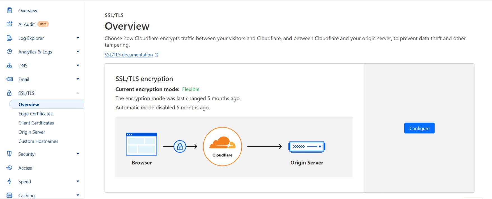
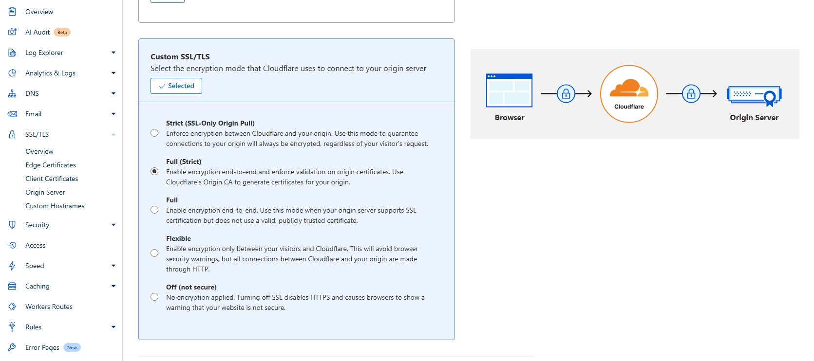
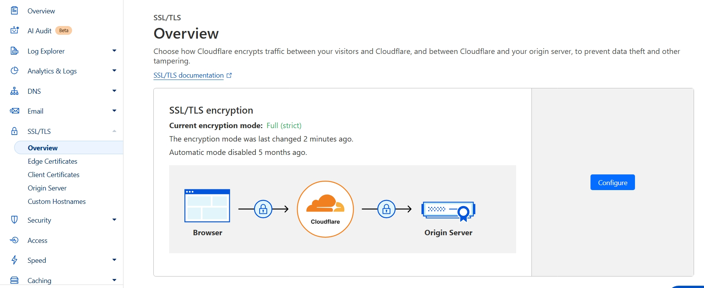
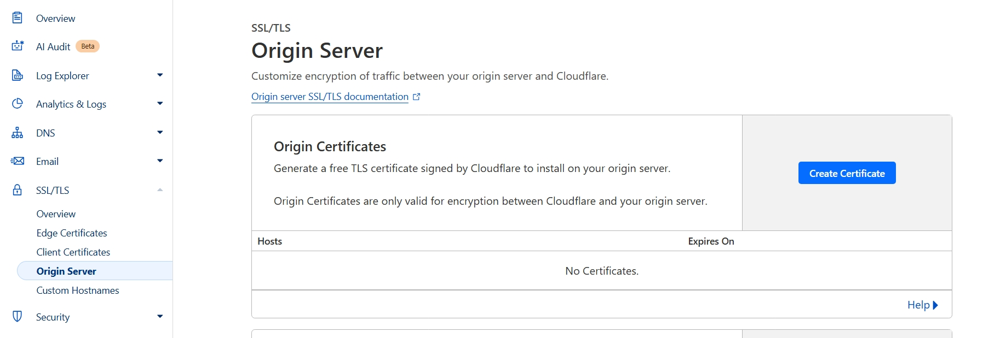
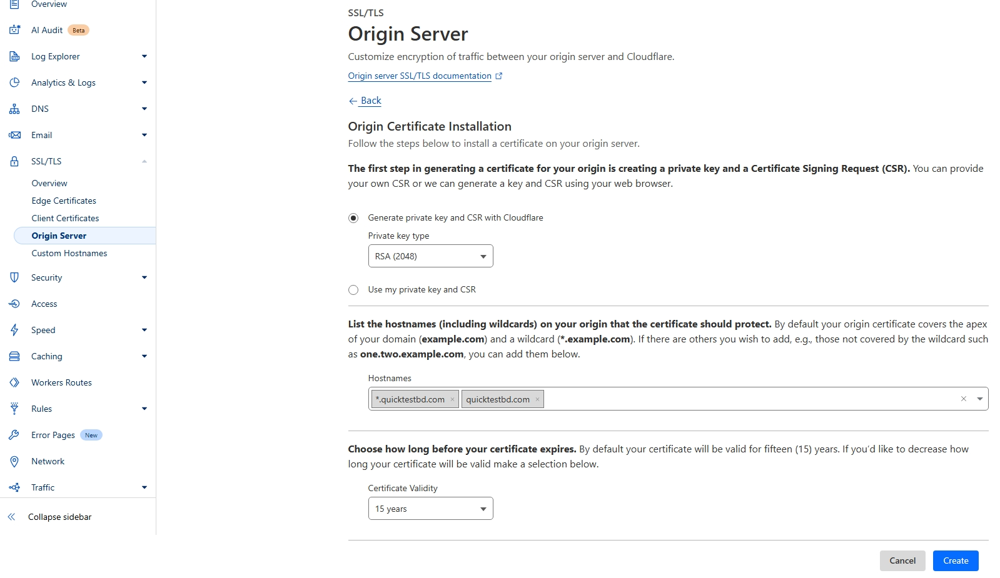
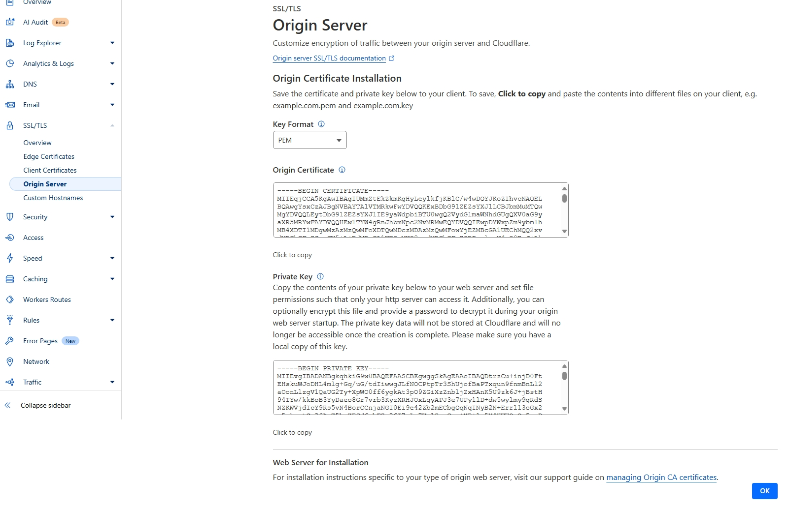
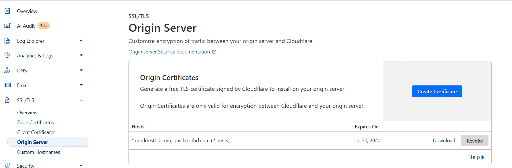
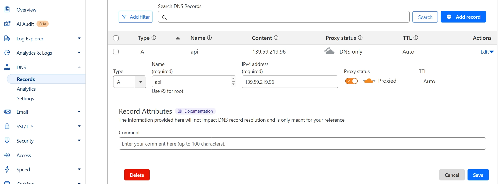

# Domain SSL Cloudflare Certificate Configure Steps

After hosting your app, follow the instructions below

## 1. Install Nginx

```
sudo apt install nginx
```

Go to this location

```
sudo nano /etc/nginx/sites-available/default
```

Add the following to the location part of the server block

```
        location / {
                # First attempt to serve request as file, then
                # as directory, then fall back to displaying a 404.
                # try_files $uri $uri/ =404;

                proxy_pass http://localhost:5000; #whatever port your app runs on
                proxy_http_version 1.1;
                proxy_set_header Upgrade $http_upgrade;
                proxy_set_header Connection 'upgrade';
                proxy_set_header Host $host;
                proxy_cache_bypass $http_upgrade;
        }
```

Check NGINX config error

```
sudo nginx -t
```

Restart NGINX

```
sudo service nginx restart
```

You should now be able to visit your IP with no port (port 80) and see your app. Now let's add a domain

## 2. Configure Cloudflare and obtain SSL Certificate and store it in the Server

Buy a domain or add one by adding nameservers in cloudflare.

Go to that specific domain and do below things

### 2.1 Encryption Mode Configure

From the left sidebar go to **_SSL/TLS ➡️ Overview_**

Default ssl encryption mode is **_Flexible_**


Configure or change the mode to **_Full (Strict)_** and save


Now ssl encryption mode is **_Full (Strict)_**


### 2.1 Create Certificate

From the left sidebar go to **_SSL/TLS ➡️ Origin Server_**


Create Certificate


Copy Origin Certificate and save it in a file **_cert.pem_**
Copy Private Key and save it in a file **_cert_key.pem_**

Filename can be changed but file extension should be **_.pem_**


Certificated created for domain and all subdomains


### 2.3 Store Certificate in Server

On the server create a folder and go to that folder

```
sudo mkdir ssl_certificates
cd /ssl_certificates
```

On that folder create two **_PEM_** files for certificate and certificate key

Create **_cert.pem_** and copy the **_Origin Certificate_**

```
sudo nano cert.pem
```

To save

```
Press➡️ ctrl+x
Press➡️ y
Press➡️ enter
```

Create **_cert_key.pem_** and copy the **_Private Key_** of Certificate

```
sudo nano cert_key.pem
```

To save

```
Press➡️ ctrl+x
Press➡️ y
Press➡️ enter
```

To check the parent directory path run

```
pwd
```

Output (Example):

```
/root/ssl_certificates
```

If your output is like this `/root/ssl_certificates` then
certificate path is `/root/ssl_certificates/cert.pem` and key path is `/root/ssl_certificates/cert_key.pem`

## 3. Connect certificate

Go to server and follow below steps:

### 3.1 Rewrite sites-available/default

Open file location

```
sudo nano /etc/nginx/sites-available/default
```

Rewrite the file

```
# Redirect all HTTP traffic to HTTPS
server {
        listen 80;
        listen [::]:80;
        server_name api.quicktestbd.com; # change to your domain or subdomain

        return 301 https://$host$request_uri;
}

# HTTPS server block using Cloudflare Origin Certificate
server {
        listen 443 ssl;
        listen [::]:443 ssl ipv6only=on;

        server_name api.quicktestbd.com; # change to your domain or subdomain

        root /var/www/html;
        index index.html index.htm index.nginx-debian.html;

        ssl_certificate /root/ssl_certificates/cert.pem;
        ssl_certificate_key /root/ssl_certificates/cert_key.pem;

        # Recommended SSL config (you can customize as needed)
        # ssl_protocols TLSv1.2 TLSv1.3; # Enforce secure TLS versions
        # ssl_prefer_server_ciphers on; # Force strong ciphers
        # ssl_ciphers 'ECDHE-ECDSA-AES128-GCM-SHA256:ECDHE-RSA-AES128-GCM-SHA256:ECDHE-RSA-AES256-GCM-SHA384'; # Define safe cipher suites
        # ssl_session_cache shared:SSL:10m; # Improve performance
        # ssl_session_timeout 10m; # cached session timeout
        # ssl_session_tickets off; # Disable session tickets, prevents attacks

        # Optional security headers
        # add_header Strict-Transport-Security "max-age=63072000; includeSubDomains; preload" always; # HTTP Strict Transport Security which enforce browser to use HTTPS even user types http://

        location / {
                # First attempt to serve request as file, then
                # as directory, then fall back to displaying a 404.
                # try_files $uri $uri/ =404;

                # Allow only Cloudflare IPs
                allow 173.245.48.0/20;
                allow 103.21.244.0/22;
                allow 103.22.200.0/22;
                allow 103.31.4.0/22;
                allow 141.101.64.0/18;
                allow 108.162.192.0/18;
                allow 190.93.240.0/20;
                allow 188.114.96.0/20;
                allow 197.234.240.0/22;
                allow 198.41.128.0/17;
                allow 162.158.0.0/15;
                allow 104.16.0.0/13;
                allow 104.24.0.0/14;
                allow 172.64.0.0/13;
                allow 131.0.72.0/22;
                deny all;

                proxy_pass http://localhost:8001; #whatever port your app runs on
                proxy_http_version 1.1;
                proxy_set_header Upgrade $http_upgrade;
                proxy_set_header Connection 'upgrade';
                proxy_set_header Host $host;
                proxy_cache_bypass $http_upgrade;

                # limiting request for bot
                limit_req zone=one burst=10 nodelay;

        }
}

```

### 3.2 Check and Reload Nginx changes

```
sudo nginx -t && sudo systemctl reload nginx
```

### 3.3 Making sure Nginx can read the certificates files

```
sudo chmod 600 /root/ssl_certificates/*
sudo chown root:www-data /root/ssl_certificates/*
```

## 4. Configure DNS

From the left sidebar go to **_DNS ➡️ Records_** <br/>
Add or edit dns record with proxy status on and save. Also wait for some times 1-10 minutes.


## 5. Visit your website with https://

<!--  -->
